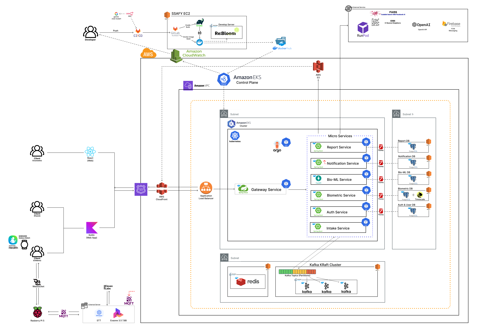

# ReBloom

청소년의 생체 데이터, 감정 일기, 스마트 스피커 대화 데이터를 함께 분석해 보호자와 상담사가 아이의 상태 변화를 확인할 수 있도록 만든 AIoT 심리 케어 서비스입니다.

## 프로젝트 정보

| 항목 | 내용 |
| --- | --- |
| 기간 | 2026.04 ~ 2026.05 |
| 인원 | 6명 |
| 형태 | SSAFY 14기 자율 프로젝트 |
| 담당 | Backend / Infra 중심 |
| 주요 담당 범위 | 인증/인가, 보호자-자녀-상담사 관계 API, 리포트 API, Kafka 이벤트 처리, EKS 배포, ArgoCD/CloudWatch 운영 확인 |

## 서비스 개요

ReBloom은 자녀, 보호자, 상담사가 서로 다른 화면과 권한으로 같은 아이의 상태를 확인하는 서비스입니다.

- 자녀는 감정 일기를 작성하고, 갤럭시 워치와 스마트 스피커를 통해 생체/대화 데이터를 제공합니다.
- 보호자는 자녀의 일별 상태, 감정 변화, 위험 신호를 확인합니다.
- 상담사는 배정된 아이의 리포트와 보호자 기록을 참고해 상담 코멘트를 남깁니다.
- AI 분석 결과는 상태 카드, 주간 리포트, 알림 이벤트로 이어집니다.

## 시스템 아키텍처

자세한 구조와 DB ERD는 [docs/architecture](docs/architecture/README.md)에 정리했습니다.



## 기술 스택

| 영역 | 기술 |
| --- | --- |
| Backend | Java 21, Spring Boot 3, Spring Security, JJWT, JPA, OpenFeign |
| Data / Event | PostgreSQL, Redis, Kafka, ShedLock |
| AI / IoT | FastAPI, Python, MQTT, Raspberry Pi, Samsung Health SDK |
| Frontend / Mobile | React, Vite, Android Kotlin, WebView, Room DB |
| Infra | Docker, GitLab CI/CD, AWS EKS, ALB Ingress, ArgoCD, CloudWatch |

## 주요 기능

### 사용자 및 관계 관리

- 자녀, 보호자, 상담사 역할 기반 회원 관리
- 보호자-자녀 관계 연결 및 상담사 배정 과정 관리
- JWT 기반 인증/인가와 Redis 기반 Refresh Token 관리
- 이메일 인증 코드 TTL 처리

### 데이터 수집 및 분석 파이프라인

- 감정 일기, 대화 데이터, 생체 데이터를 분석 파이프라인으로 연결
- 갤럭시 워치 기반 생체 데이터 5분 단위 수집 방식 구성
- 스마트 스피커와 서버 간 MQTT 기반 메시지 처리 구조 구성
- 분석 결과를 상태 카드, 리포트, 알림 이벤트로 확장

### 리포트 및 알림

- 자녀의 일별/주간 상태 리포트 저장 및 조회
- 보호자 관찰 일지와 상담사 코멘트 관리
- 위험 신호 발생 시 알림 이벤트 발행
- SSE 및 알림 서비스와 연결 가능한 이벤트 구조 구성

### 배포 및 운영 확인

- 7개 MSA 서비스를 EKS에 배포
- ALB Ingress로 외부 요청 라우팅
- ArgoCD 기반 GitOps 배포 구조 구성
- CloudWatch 로그로 서비스별 동작 상태 확인

## 담당 구현

### Backend

- `auth-service`에서 회원, 인증, 역할 기반 권한, 관계 API를 구현했습니다.
- `report-service`에서 감정 일기, 대화 분석, 상태 카드, 보호자 리포트, 상담사 코멘트 기능을 구현했습니다.
- `security-module`, `event-module`, `common-module`을 사용해 인증과 이벤트 처리의 공통 구조를 분리했습니다.
- OpenFeign을 사용해 서비스 간 필요한 검증 API를 호출하도록 구성했습니다.

### Event / Consistency

- 생체 데이터 분석, 리포트 생성, 알림 발송 과정을 Kafka 이벤트로 분리했습니다.
- 이벤트에 `correlationId`를 포함하고 MDC에 주입해 비동기 처리 구간에서도 로그를 따라갈 수 있게 했습니다.
- EKS 다중 Pod 환경에서 스케줄러가 중복 실행되지 않도록 ShedLock을 적용했습니다.
- Redis와 PostgreSQL을 역할에 따라 분리해 만료성 데이터와 기준 데이터를 다르게 관리했습니다.

### Infra

- Spring Boot 서비스들을 Docker 이미지로 구성했습니다.
- EKS Deployment, Service, ConfigMap, Ingress 리소스를 구성했습니다.
- ArgoCD와 Image Updater를 사용해 Git 기준 배포 구조를 만들었습니다.
- CloudWatch 로그 그룹을 통해 서비스별 로그를 확인할 수 있게 구성했습니다.

## 트러블슈팅

| 문제 | 원인 | 해결 |
| --- | --- | --- |
| 스케줄러 중복 실행 | EKS에서 여러 Pod가 동시에 `@Scheduled` 작업을 실행 | ShedLock을 적용해 하나의 인스턴스만 작업을 수행하도록 제어 |
| 비동기 이벤트 추적 어려움 | Kafka consumer와 thread 전환 구간에서 요청 맥락이 끊김 | Kafka Envelope에 `correlationId`를 담고 MDC에 주입 |
| Redis/PostgreSQL 상태 기준 혼동 | 만료성 데이터와 영속 데이터의 역할이 섞일 수 있음 | 인증 코드/토큰은 Redis, 회원/관계/리포트는 PostgreSQL로 기준 분리 |
| 배포 후 상태 확인 부족 | 배포 성공 여부와 실제 서비스 동작 상태는 별개 | ArgoCD 상태와 CloudWatch 로그를 함께 확인하는 체계 구성 |

## Repository Structure

```text
ReBloom
├── AI
│   └── bio-ml-service
├── AIoT
│   ├── android
│   └── rpi5
├── AIoT_Server
│   ├── app
│   └── MQTT
├── BE
│   ├── modules
│   │   ├── common-module
│   │   ├── event-module
│   │   └── security-module
│   └── services
│       ├── auth-service
│       ├── biometric-service
│       ├── gateway-service
│       ├── intake-service
│       ├── notification-service
│       └── report-service
├── FE
│   ├── mobile-app
│   └── web
├── Infra
│   ├── db
│   └── eks
├── docs
│   ├── architecture
│   └── 산출물
└── exec
```

## 실행 참고

각 서비스는 PostgreSQL, Redis, Kafka, MQTT, AWS 리소스, 외부 AI 서버 등 환경 의존성이 있습니다. 로컬 실행 시에는 각 서비스의 `application.yaml`과 배포용 환경 변수를 기준으로 필요한 값을 별도로 구성해야 합니다.

민감 정보는 저장소에 포함하지 않았으며, 실제 실행 환경에서는 secret/env 파일 또는 클라우드 secret 리소스를 통해 주입하는 것을 전제로 합니다.

시연 자료와 기존 화면 캡처는 [docs/산출물](docs/산출물)에 보관되어 있습니다.
