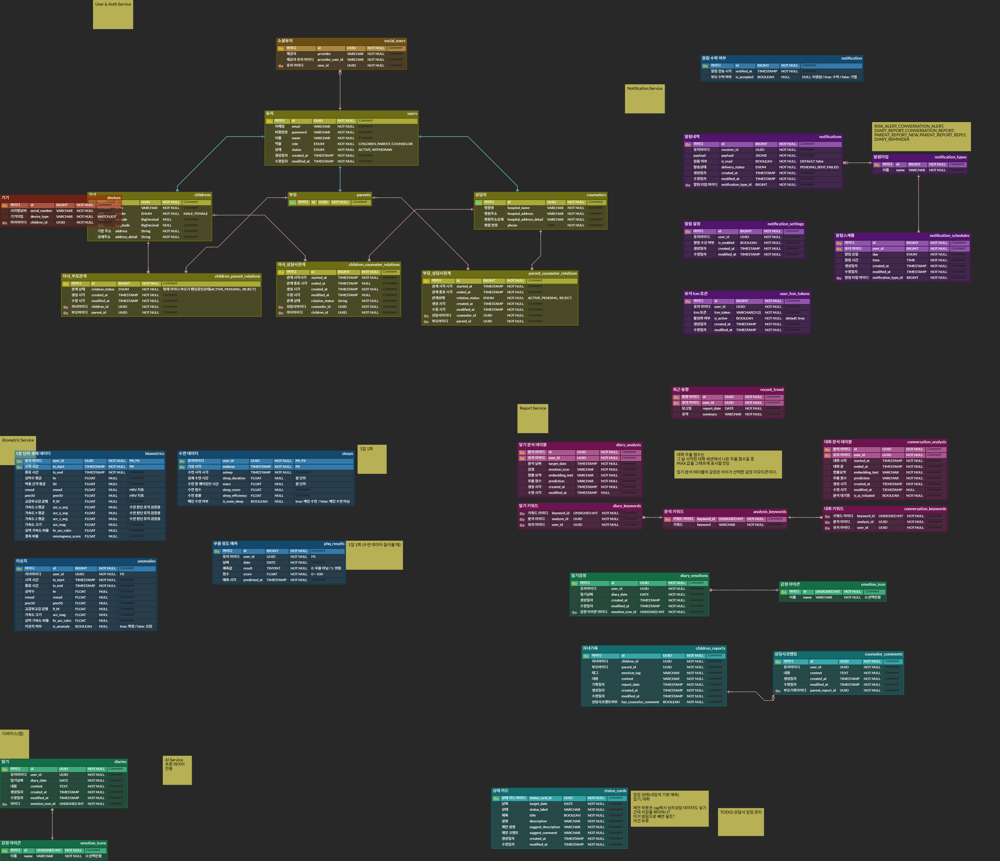

# ReBloom Architecture

이 문서는 ReBloom의 시스템 구성과 데이터 구조를 정리한 문서입니다.

## System Architecture

## 구성 요약

- 클라이언트는 상담사용 Web, 보호자/자녀용 WebView 기반 앱으로 분리했습니다.
- 외부 요청은 CloudFront와 ALB를 거쳐 EKS 내부 Gateway Service로 진입합니다.
- EKS 내부에는 Gateway, Auth, Intake, Biometric, Report, Notification, Bio-ML Service를 MSA 형태로 배포했습니다.
- 서비스 간 이벤트성 처리는 Kafka KRaft Cluster를 기준으로 분리했습니다.
- 인증 코드, 토큰, 일시적 상태 데이터는 Redis에 두고, 서비스별 기준 데이터는 DB를 분리해 관리했습니다.
- Raspberry Pi 기반 스마트 스피커는 MQTT, WebSocket, STT/TTS 서버와 연결됩니다.
- RunPod, OpenAI, Firebase FCM, FAISS/KNN 등 외부 AI/알림 서비스를 함께 사용했습니다.
- 배포와 운영 확인은 GitLab CI/CD, Docker Hub, ArgoCD, CloudWatch를 통해 구성했습니다.

## Service Responsibility

| Service | Responsibility |
| --- | --- |
| `gateway-service` | 외부 요청 진입점, 서비스 라우팅 |
| `auth-service` | 회원, 인증/인가, 보호자-자녀-상담사 관계 관리 |
| `intake-service` | 감정 일기, 대화 데이터 등 입력 데이터 수집 |
| `biometric-service` | 워치 기반 생체 데이터 저장 및 이상 징후 분석 |
| `report-service` | 상태 카드, 감정 분석 결과, 보호자 리포트, 상담사 코멘트 관리 |
| `notification-service` | 위험 신호 알림, FCM/SSE/MQTT 연동 관리 |
| `AIoT_Server` | 스마트 스피커 대화 API, SSE 응답 스트리밍, MQTT publish 유틸리티 |
| `bio-ml-service` | 생체 데이터 기반 분석 모델 서빙 |

## Data 기준

- 워치 생체 데이터는 5분 단위 수집 주기에 따라 `biometric-service`에 전달됩니다.
- 감정 일기와 대화 데이터는 분석 대상 이벤트로 분리되어 리포트 생성 파이프라인에 연결됩니다.
- Kafka 이벤트에는 `correlationId`를 포함해 비동기 처리 구간에서도 로그 추적이 가능하도록 구성했습니다.
- 스케줄러 기반 리포트 생성은 EKS 다중 Pod 환경에서 중복 실행될 수 있어 ShedLock으로 실행 기준을 맞췄습니다.
- Redis는 인증 코드, Refresh Token처럼 만료 시간이 중요한 데이터에 사용하고, PostgreSQL은 회원, 관계, 리포트 같은 기준 데이터에 사용했습니다.

## Database ERD

ERD는 사용자/관계, 알림, 생체 데이터, 감정 일기, 분석 결과, 보호자 리포트, 상담사 코멘트 중심으로 구성되어 있습니다.
